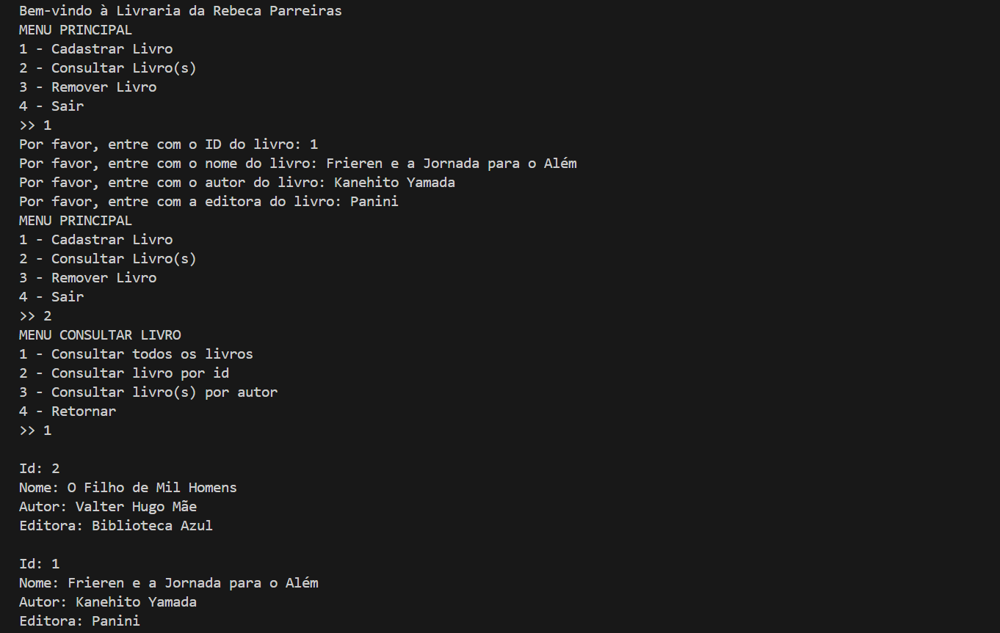

# Gerenciamento de livros | Python

Trabalho para a disciplina Lógica de Programação e Algoritmos. 

O objetivo é criar um sistema de gerenciamento de livros para uma livraria que exercesse as seguintes funcionalidades:

<ul>
  <li>Cadastrar livro;</li>
  <li>Consultar livro;</li>
  <li>Remover livro;</li>
  <li>Encerrar o programa.</li>
</ul>

Para isso, separei o projeto em algumas <a href="https://github.com/rebecaparreiras/gerenciamento-livros/tree/main/src">dependências</a>: 

<ul>
  <li><b>main.py:</b> ponto de entrada do programa, onde mostra o menu principal e chama as funções de cadastro, consulta, remoção e persistência;</li>
  <li><b>cadastro.py:</b> contém a função cadastrar_livro, responsável por adicionar livros à lista.</li>
  <li><b>consulta.py:</b> contém a função consultar_livro, que permite buscar livros por ID, autor ou listar todos;</li>
  <li><b>remocao.py:</b> contém a função remover_livro, que remove um livro da lista com base no ID;</li>
  <li><b>persistencia.py:</b> lê (carregar_livros) e grava (salvar_livros) a lista de livros no arquivo JSON. Garante que os dados permaneçam salvos entre execuções.</li>
</ul>

Além de criar um arquivo JSON <a href="https://github.com/rebecaparreiras/gerenciamento-livros/blob/main/data/livros.json">'livros.json'</a> com um array inicialmente vazio para receber e guardar as informações dos livros cadastrados.

## Preview

  

